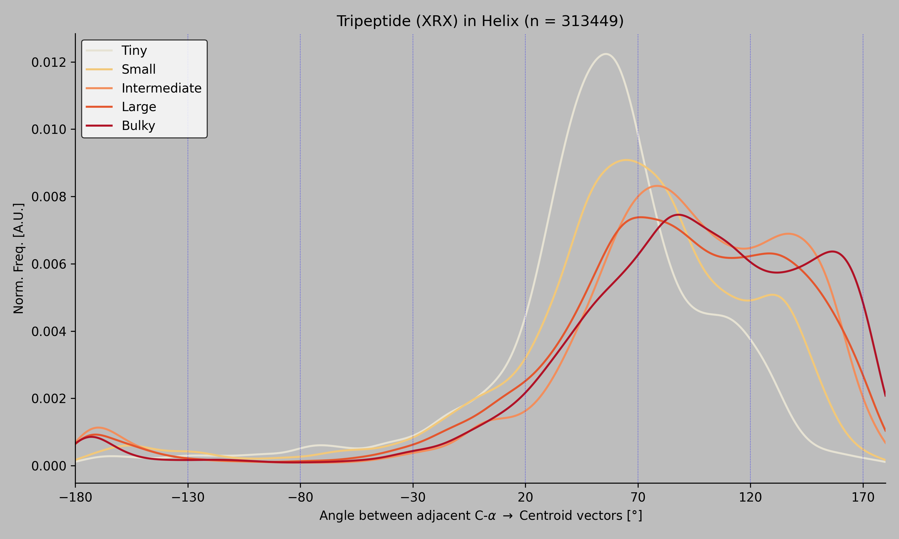

# BET-105 Assignment

For every Arginine inside an alpha-helix triplet (HHH), this pipeline
computes the signed 3D angle between adjacent C-α → centroid vectors
and groups the angle distribution by the size class of the left
neighbour.

## Plot



PDBs that contributed angles to the plot:
[`final/valid_pdbs.txt`](final/valid_pdbs.txt)

## Run

Place `.pdb.gz` files inside a `pdbs/` folder at the repo root, then:

```bash
snakemake --cores 8
```

The plot is written to
`final/ss_profile_HHH_for_arg_with_valid_runs.png`.

## Requirements

- Linux / WSL
- STRIDE on the PATH (or set `stride_path` in `config.yaml`)
- Python: `snakemake biopython pandas numpy scipy matplotlib tqdm pyyaml`
